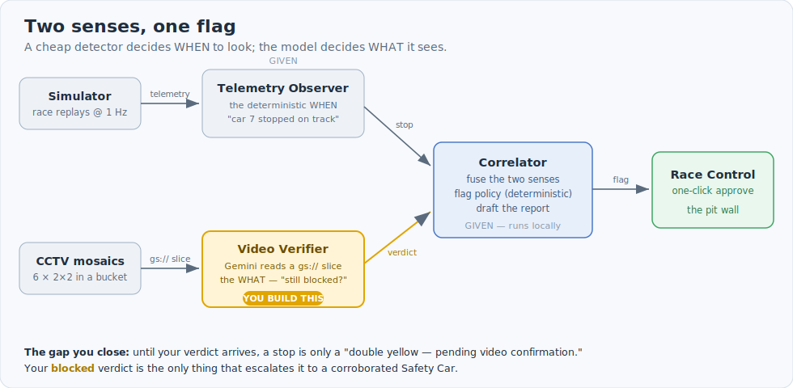

<!-- TINYURL: https://tinyurl.com/FE-Hack-3  (set this to the short link you hand out) -->
# Build a Formula E Video Verifier

You are going to give Race Control a second sense. Telemetry can already see a car
stop — and it even knows a pit stop from a track stop, because it knows *where* the
car is. What it can't do is judge what a car stopped *out on the track* actually means:
has it really come to rest, or is it a spin it'll drive out of? Is the racing line
blocked in a way that endangers the cars still coming? That judgment needs eyes. You'll
build the piece that looks at the CCTV and answers it — and when it works, it's what
authorises the Safety Car.

## STEP 0 — do this FIRST, before the instructor starts talking

First, get your notebook warming up in the background — *then* kick off the long build.
In Cloud Shell:

```bash
git clone https://github.com/haggman/formula-e-race-control-observer.git
cd formula-e-race-control-observer
source activate.sh                 # venv + project + the starter/solution seam
bash setup/print_colab_link.sh     # prints your notebook import link
```

Click that link **in Cloud Shell** (not from these notes; see "When things go sideways").
In the Colab tab that opens: **import** the notebook, **Connect** the runtime (top-right),
and click **Enable APIs** at the top. The compute node takes a couple of minutes to build,
so starting it now means it's ready when you actually need it.

Then come back to Cloud Shell and start the stack:

```bash
bash setup/all.sh                  # builds everything (~15 min)
```

⏸ **STOP HERE. Eyes up front.** The instructor opens with the finished thing so you
know what you're building toward.

## Welcome back

Here's the whole design in one paragraph. A Formula E race replays at 1 Hz. A
**Telemetry Observer** (given) watches the cars' own data and flags a car that has
stopped on track — cheap, deterministic, instant. A **Correlator** (given) fuses the
observations, decides a flag, and drafts a report for a human to approve with one click.
The missing piece is the **Video Verifier** — *you build it* — which reads the trackside
CCTV and confirms whether a flagged on-track stop is a real, persistent blockage. Until
it works, Race Control can only offer *"double yellow — pending video confirmation."*
When it works, the recommendation escalates to **Safety Car · corroborated**.

## The architecture at a glance



## The two senses — why a camera at all

It's tempting to say "a pit stop and a crash look the same to telemetry." They don't,
quite — telemetry knows the car's GPS, so it already tells a pit stop apart and says so
out loud on the board: *"routine pit stop, not a track incident"* (you'll see exactly this
when you click the **#33 (pit — no flag)** button in Task 0). The hard part is the
car that stops **out on the track**. Telemetry sees speed drop to zero, but it can't see
*why*, or whether it lasts:

- Did the car actually stop, or is it a spin that gathers it up and drives on?
- Is it a genuine obstruction on the racing line, or off in a run-off where it's safe?
- Is it *still* there a minute later, or already gone?

Those are questions about what the track **looks like**, and only a camera can answer
them. So telemetry raises its hand — *"car #7 has been stationary for 18 seconds"* — and
your verifier gives the second opinion: **is the racing line actually, still blocked?**
The flag itself is then decided by deterministic code (`correlator/fusion.py`), never by
the model — a safety call must be explainable and repeatable. The model narrates; the
policy decides.

Read [`HOW_IT_WORKS.md`](HOW_IT_WORKS.md) before you edit code. It's ten minutes and it's
the difference between a verifier that works and one that confidently lies to Race Control.

## The map

Three browser worlds and one terminal:

- **The console** — the Race Control pit wall (a Cloud Run URL). You didn't write it; you
  just watch your verdict light it up.
- **The notebook** (`fe_video_lab.ipynb`, in Colab) — your workbench, and where the real
  thinking happens. It's a fast loop (seconds per try, not a minutes-long Cloud Run
  rebuild) for four things: explore the telemetry and find a stop yourself; prove the
  video/time alignment; make your first Gemini call on a video slice; and — the main event
  — **iterate your own prompt** until it reliably calls a blockage. That prompt is what you
  port into `verifier.py`. Reopen it any time with `bash setup/print_colab_link.sh`.
- **Cloud Shell** — where you run your correlator (`python -m correlator.service`) and the
  standalone verifier tests.

You edit exactly one file: `starter/video_verifier/verifier.py`. Stuck? The same file in
`solution/` is the complete answer key — opening it is shipping, not cheating.

---

# The build — four tasks, ~2h15

Each task follows the same scaffold: **Open** → **Your challenge** → **Test it** →
**What just happened (and why that's the point)** → **Done looks like** → **Checkpoint**.

## Task 0 — Orientation: see the missing sense (~15 min)

**Open the console.** Get its URL and click it (Cloud Shell makes URLs clickable):

```bash
gcloud run services describe fe-console --region "$REGION" --format='value(status.url)'
```

Then, in a fresh Cloud Shell tab, start the correlator with the verifier turned off:

```bash
source activate.sh
python -m correlator.service --no-verify        # telemetry only — no video yet
```

**Your challenge:** on the console's bottom bar, click the **Günther** jump button. Read
what Race Control can and cannot say.

**Test it:** telemetry nails the stop — *car #7 stopped, still stopped after 18s,
confirmed blockage* — and the recommendation sits at **DOUBLE YELLOW, pending video
confirmation**. The **Video Agent column is dead.** Now click the **#33 (pit — no flag)**
button: the system spots a stationary car and correctly says *"routine pit stop, not a
track incident"* — the board stays green. It's as proud of what it *doesn't* flag as what
it does.

**What just happened (why):** the system has one sense and *knows* it. It won't guess a
Safety Car from a bare telemetry stop, because a stopped car on track is ambiguous until
someone looks. That dead video column is the gap you'll fill.

**Done looks like:** Günther = double yellow; #33 = no flag with a visible reason.

**Checkpoint:** you can say, out loud, why a prolonged stop is *still* only a double
yellow here.

## Task 1 — First Gemini call (~20 min, in the notebook)

**Open:** `fe_video_lab.ipynb`. Work through sections 0–4 — **read and examine each cell
before you run it**, so you understand what it's doing, then run it.

**Your challenge:** get one camera group's window into Gemini and have it *describe* the
scene around the stop. You're pointing Gemini straight at a `gs://` mosaic and passing
`videoMetadata` start/end offsets, so it decodes **only** the 60-second window — no
download, no ffmpeg. (Section 4 links the docs for the exact API surface.)

**Test it:** section 4 returns raw text — Gemini telling you what it sees at the Günther
stop. That's the magic moment: a model reading a slice of a video straight from a bucket.

**What just happened (why):** you proved the alignment first (section 3 — mp4 offset *N*
== race-second *N*), so "the footage around the stop" needs *no* clock conversion.
**Everything you build rests on that fact.**

**Done looks like:** a paragraph of description comes back for the Günther window.

**Checkpoint:** you can explain why 24 cameras became 6 Gemini calls.

## Task 2 — Write the persistence prompt (~40 min, in the notebook) — THE HEART

Spend your time here. This is the best discussion of the day, and it's the part you
actually invent.

**Open:** section 5 of the notebook — the prompt workbench. It hands you a blank
`PROMPT = "Your prompt here…"` and a cell that runs *your* prompt against the one camera
where we know the Günther stop is visible.

**Your challenge:** write the question so that **one** answer separates a real retirement
from a spin-and-recover. The naive prompt — *"is there a stopped car?"* — can't: a car can
be stopped at second 5 and gone by second 50. Both are "a stopped car"; one needs a Safety
Car and the other needs nothing. The question that works is about the **track's state at
the END of the window**:

> *"By the END of this window, is the racing line still BLOCKED, or did it CLEAR?"*

The notebook shows you the exact JSON you must get back (`blockage`, `cleared`, `panel`,
`feed_live`, `seen_car`, `what_you_see`, `confidence`) and an example of a good answer.
Iterate on the single camera until it reliably returns `blockage: true` with a sensible
description. Then run it across all six groups and confirm the combined verdict is
**blocked**, and run the two other cases (a clear one and another blockage).

**Stuck on the wording?** The last cells of the notebook hold two reference prompts — one
half-finished (hints, gaps to fill) and one complete. Reach for the half one first.

**What just happened (why):** the 50-second *tail* is the entire design. It's what lets one
question do all the work — ask at the *end* of the window and a retirement stays blocked
while a recovery clears itself. *(War story: verify too early, before the window has
played, and you're asking about footage that hasn't happened. The model will oblige you
with a hallucinated crash.)*

**Done looks like:** your own prompt returns **blocked** for the Günther stop, on the
single camera and across the sweep.

**Checkpoint:** show your prompt and defend the one sentence that makes it work.

## Task 3 — Port it: the board lights up (~40 min)

**Open:** `starter/video_verifier/verifier.py`. Three methods are stubbed:

- `_prompt(...)` — the question + JSON contract you just tuned in the notebook.
- `VideoVerifier._verify_group(...)` — one Gemini call over one `gs://` slice → parsed
  dict (the file docstring names the exact API surface).
- `VideoVerifier._aggregate(...)` — fuse the six replies into one `VideoVerdict`. Core is
  `blocked` vs `unseen`; the honest `cleared` and `error` states are Bonuses 4 & 5.

**Test it — standalone first (fast), no full stack:**

```bash
python -m starter.video_verifier.verifier --at 693 --cars 7        # -> blocked, Cam05  (Günther)
python -m starter.video_verifier.verifier --at 1698 --cars 17 23   # -> blocked, Cam07  (Fenestraz + Nato)
python -m starter.video_verifier.verifier --at 1780 --cars 48      # -> blocked, Cam07
```

**Then the real test:** restart your correlator **with the verifier armed**, open the
console, and click **Günther**:

```bash
python -m correlator.service        # no --no-verify this time
```

The Video Agent column narrates — *[QUEUED] → [ANALYZING] → CONFIRMED, track blocked,
Cam05* — and the recommendation goes from **DOUBLE YELLOW** to **SAFETY CAR ·
corroborated**. The Approve button lights up.

**What just happened (why):** your verdict is the *only* thing that lifts a stop to a
Safety Car (corroboration is the sole escalator). The board lighting up is *your* code
authorising the flag. Edit → Ctrl-C → rerun: the deployed console updates in seconds,
because the correlator runs locally.

**Done looks like:** clicking **Günther**, **Fenestraz + Nato**, and **Mortara** all reach
a corroborated Safety Car; **#33** stays a note.

**Checkpoint demo:** click **Günther** live and narrate the escalation to the room.

---

## Acceptance tests (your green light)

```bash
python -m starter.video_verifier.verifier --at 693 --cars 7        # blocked, Cam05  (Günther #7 retires)
python -m starter.video_verifier.verifier --at 1698 --cars 17 23   # blocked, Cam07  (Fenestraz #23 + Nato #17)
python -m starter.video_verifier.verifier --at 1780 --cars 48      # blocked, Cam07
```

A stop that recovers should come back `cleared`, not `blocked` — that's the false-alarm
veto (Bonus 4). The camera ids are what the reference mapping returns; yours should agree.

## Question bank (for your demos)

| Ask | What it proves |
|---|---|
| Click **#33 (pit — no flag)** — why no flag? | Telemetry IDs the pit stop by location; no camera needed for that one. |
| Click **Günther** with `--no-verify`, then with the verifier armed | Corroboration is the escalator — one sense is only a double yellow. |
| Verify at the stop vs after the window has played | "Confirm from what happened; never peek ahead" — the tail is the design. |
| **Fenestraz + Nato**: why does the flag stand after Nato drives off? | The flag holds while *#23* is stranded; #23 recovering is what would clear it. |
| Point the verifier at a bad bucket | `error` ≠ `unseen`: an outage must not read as an all-clear. |

## When things go sideways

| Symptom | Cause | Fix |
|---|---|---|
| Everything's broken / commands "not found" | forgot to activate | `source activate.sh` from the repo root — always the first fix |
| Colab link opened the wrong project | clicked from these notes, not Cloud Shell | rerun `bash setup/print_colab_link.sh` and click it *in Cloud Shell* |
| `400 FAILED_PRECONDITION: service agents are being provisioned` | fresh-project Vertex service agent still propagating | wait a few minutes (setup provisions it early; the verifier retries) — don't change your code |
| `403 / permission denied` reading the mosaics | Vertex service agent lacks bucket read | rerun `bash setup/2_provision_vertex_agent.sh` |
| Gemini "hallucinated a crash" on a car doing 130 km/h | verified too early, or verified a non-stop | only verify a real *stop*, and after the window has played (Task 2) |
| It's really slow (~60s per stop) | the sweep is sequential on purpose | that's **Bonus 1** — make it concurrent |
| Flag never reaches Safety Car | verdict isn't returning `blocked`, or you didn't restart the correlator after editing | check the standalone CLI, then Ctrl-C + rerun `python -m correlator.service` |
| "It says no CCTV view" | wrong `videoMetadata` offsets or group list | check your `_verify_group` offsets and that all six groups ran |

## Finished early?

The board's lit — now make it better. See [`BONUS.md`](BONUS.md): make the sweep
concurrent (feel ~60s become ~10s), teach it to name the car by livery, and the best
design argument in the hack — *should a camera-blind Safety Car be paralysed, or escalate
anyway?*
